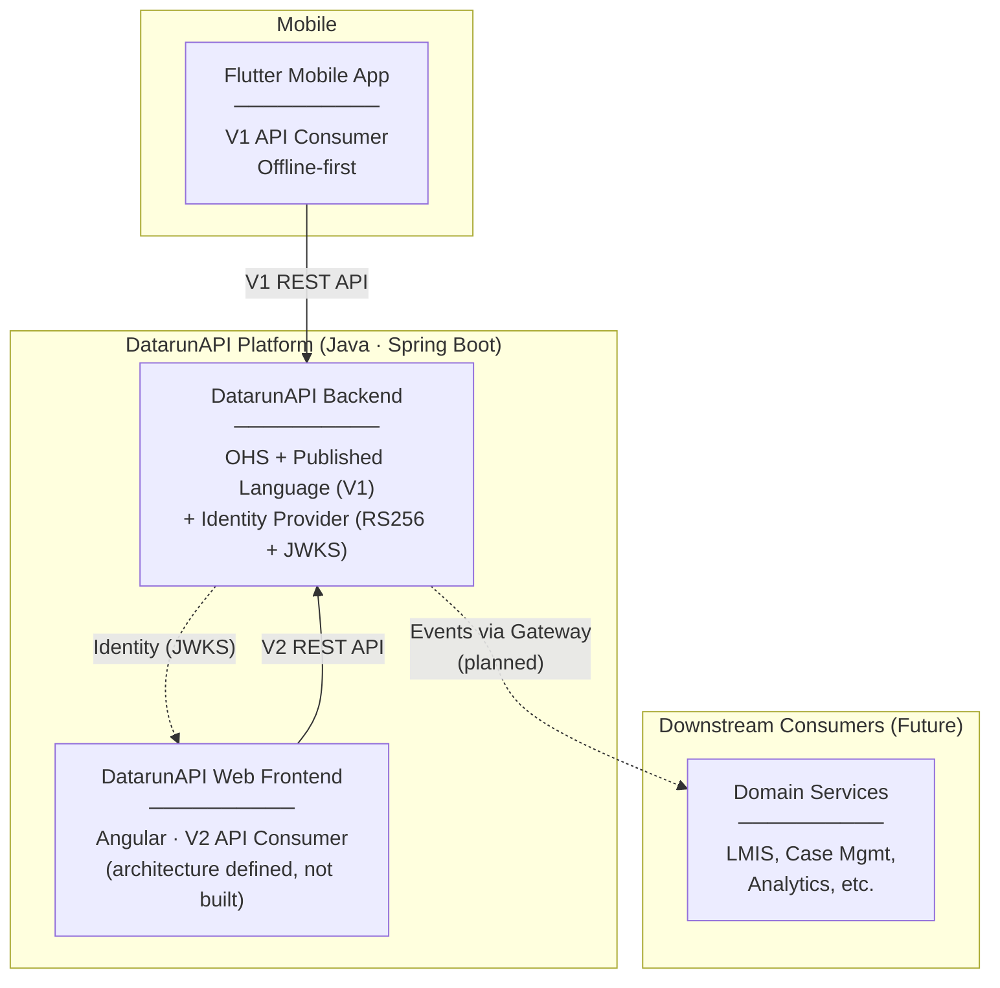

# Context Map — Datarun Platform

> **Status:** Draft — Living Document
> **Ground Truth:** Only the DatarunAPI platform and mobile app are operational.

## Overview

This document defines the **DDD Strategic Relationships** between operational systems and directional (planned) components. It is a living document — relationships will be added via ADRs as the architecture evolves.

---
title: Context Map

## Operational Context Diagram

**Legend:** Dashed lines = planned / not yet implemented.

---
title: Context Map

## Operational Relationships

| From | To | Pattern | Contract Owner | Notes |
|------|-----|---------|---------------|-------|
| **Mobile App** | **DatarunAPI** | Client → OHS | DatarunAPI owns V1 API | Offline-first, sync on connectivity |
| **DatarunAPI Web Frontend** | **DatarunAPI Backend** | Presentation → OHS | DatarunAPI owns V2 API | Architecture defined, not yet built |
| **DatarunAPI** | **All consumers** | Identity Provider | DatarunAPI owns JWKS | RS256 JWT. No consumer-specific vocabulary in JWT |

## Directional Relationships (Planned)

> [!NOTE]
> These relationships are part of the strategic vision. They will be formalized via RFCs and ADRs when implementation begins. For detailed conceptual designs, see [`/_ideas/`](../_ideas/).

| From | To | Pattern | Notes |
|------|-----|---------|-------|
| **DatarunAPI** | **Downstream Domain Services** | OHS + Published Language → ACL (downstream) | Gateway delivers events; each consumer translates via its own ACL |
| **DatarunAPI** | **Event Gateway** | Transactional Outbox | Planned integration point — see [/_ideas/gateway/](../_ideas/gateway/) |

---
title: Context Map

## Boundary Rules (Active)

1. **DatarunAPI never contains domain-specific vocabulary** (stock, commodity, ledger, case). It stays generic.
2. **UIDs are stable and domain-agnostic.** 11-char identifiers generated by `CodeGenerator` are the canonical reference across all systems.
3. **Identity = DatarunAPI.** JWT contains only generic claims (`sub`, `name`). Domain-specific authorization lives in downstream systems.
4. **V1 and V2 APIs coexist.** Both serve the same canonical store. V1 remains for mobile. V2 is exploratory for web frontend.

## Boundary Rules (Directional — Not Yet Enforced)

5. **Adding a new downstream consumer** should require only a new Gateway mapping config and, optionally, a new entry in this Context Map. No changes to existing consumers.
6. **Each downstream domain owns its own ACL.** DatarunAPI is not responsible for translating submissions into domain-specific shapes.

---
title: Context Map

## Related Docs

- [System Overview](system-overview.md)
- [Strategic Blueprint](strategic-blueprint.md)
- [Integration Contract — DatarunAPI](integration-contract-datarunapi.md)
- [Auth & Authorization](auth-and-authorization.md)
