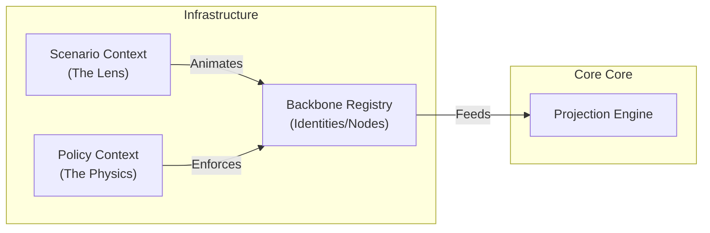

> **Status:** Active — Living Document
> **Scope:** DDD Strategic Relationships (L2)
> **Ground Truth:** The `datarunapi` codebase is the source of truth.

## Quick Reference
| Relationship | Relationship Type | Pattern |
| :--- | :--- | :--- |
| **Registry ──► Functional Domain** | OHS / Published Language | Event-Driven / Sync |
| **Scenario ──► Registry** | Downstream (Conformist) | Metadata Projection |
| **Policy ──► Registry** | ACL / Physics Engine | Transactional Rule Check |

---

## 1. Tactical Bounded Contexts (The Engine)

The system is partitioned into the following Pure Bounded Contexts:

---

## 2. Strategic Strategic Relationships

| From | To | Pattern | Responsibility |
| :--- | :--- | :--- | :--- |
| **Registry** | **Functional Domain** | OHS + Published Language | Registry provides stable UIDs; Domains interpret meaning. |
| **Scenario** | **Engine** | Supplier → Customer | Scenario provides the "Reality Metadata" required for orchestration. |
| **Legacy Adapter** | **Registry** | Anti-Corruption Layer (ACL) | Maps legacy tables (`team`, `org_unit`) to Registry UID backbone. |

---

## 3. Boundary Rules

1.  **Datarun never contains domain vocabulary.** (No "Stock", "Malaria").
2.  **Identities are globally unique.** 11-char UIDs are the only shared currency.
3.  **Projections are Contextual.** An Identity can have different roles in different Scenarios without changing the core Identity record.

---

## Related Docs
- [Strategic Blueprint](strategic-blueprint.md) (L1 Strategy)
- [System Overview](system-overview.md) (L2 Component Model)
- [Living Architecture Charter](../governance/index.md) (Governance)
