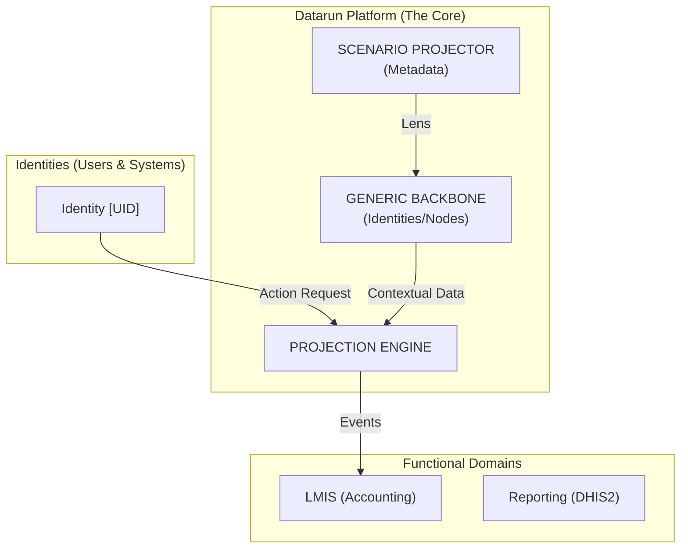

> **Status:** Active — Living Document
> **Scope:** Architecture Component Model (L2)
> **Ground Truth:** The `datarunapi` codebase is the source of truth for current state.

## Quick Reference
| Component | Responsibility | Pattern |
| :--- | :--- | :--- |
| **Backbone** | Maintaining raw Registry Identities/Nodes. | Domain-Agnostic Store |
| **Projector** | Animating Backbone via Scenario Metadata. | Orchestration Engine |
| **Policies** | Enforcing "Physics" of Contextual Action. | Bounded Permission Model |
| **Adapter** | Bridging Legacy Sync Channels (V1/V2). | ACL / Anti-Corruption Layer |

---

## 1. Vision: The Contextual Projection Engine

Datarun is a **stateless orchestration engine** that projects business meaning onto a generic backbone. It does not "hold" business logic; it "executes" configuration.

### The Component Model (Level 1 Context)

---

## 2. Core Architectural Abstractions

### A. The Backbone (Stable Universe)
A universe of raw **Identities** (People/Systems) and **Nodes** (Locations/Groups). They have zero business meaning. They are globally unique references (11-char UIDs).

### B. The Scenario (The Lens)
A metadata bundle that defines a "Reality." It maps UIDs to Roles (e.g., "Pharmacist") and Nodes to Meanings (e.g., "Supply Hub").

### C. Contextual Projection (The Binding)
The dynamic act of manifesting an Identity as a **Party** (e.g., "Supervisor") in a specific Scenario. This is the **Behavioral Layer** of the system.

---

## 3. What This System Is NOT

- **Not a domain-specific system.** Datarun never contains business logic for stock, medicine, or cases.
- **Not a hard-coded hierarchy.** Hierarchies are just "Relational Metadata" projected onto the Backbone.

---

## Appendix: Legacy Mappings (Adapter Layer)

To maintain operational continuity, the following legacy entities are currently mapped to the Backbone:

| Legacy Entity | Registry Mapping | Note |
| :--- | :--- | :--- |
| `team` | **Registry Party** | Temporary container for user groups. |
| `org_unit` | **Registry Node** | Static hierarchy representation. |
| `assignment` | **Policy Binding (Proxy)** | Links Template to Context. |

---

## Related Docs
- [Strategic Blueprint](strategic-blueprint.md) (L1 Strategy)
- [Context Map](context-map.md) (DDD Relationships)
- [Living Architecture Charter](../governance/index.md) (Governance)
