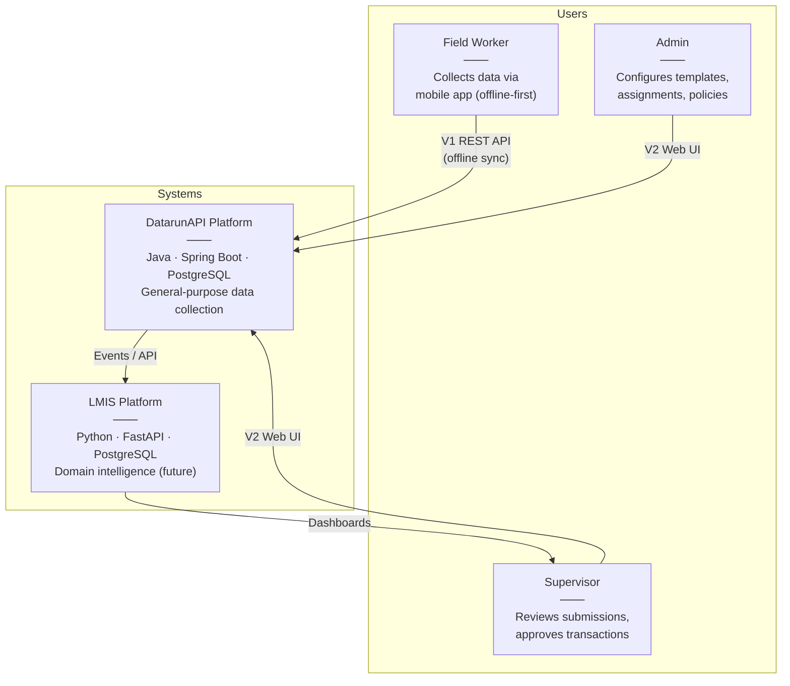
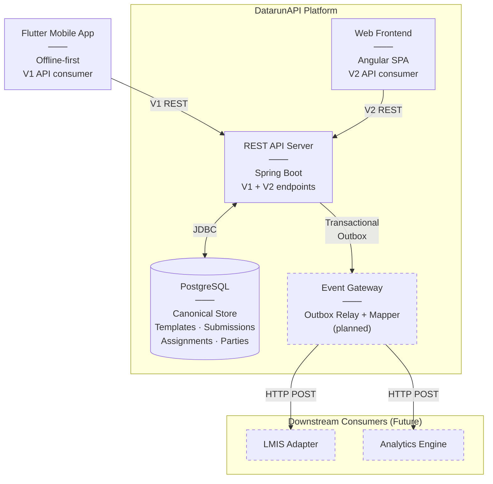
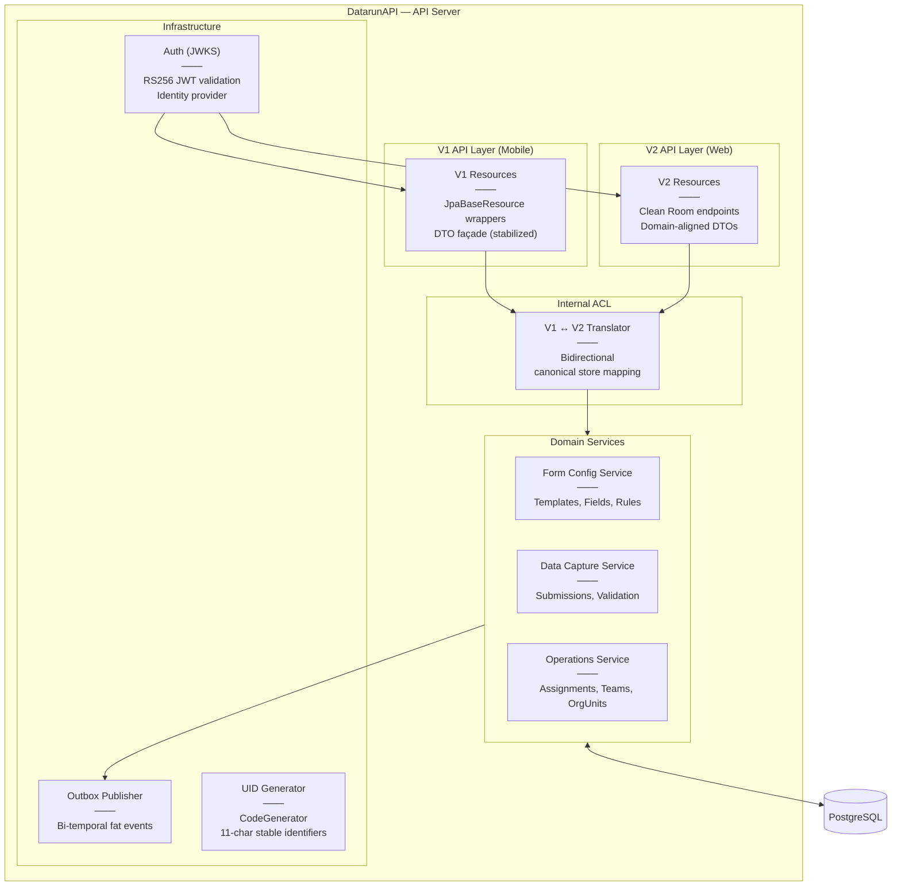
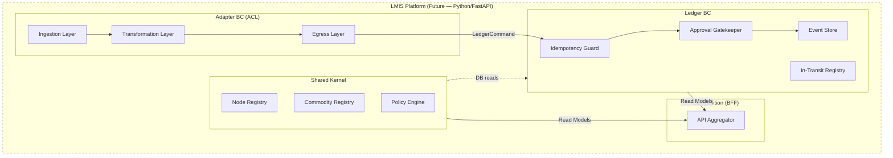

> **Status:** Draft — Living Document
> **Scope:** Cross-cutting — full system context
> **Notation:** [C4 Model](https://c4model.com/) rendered as Mermaid diagrams

---

## Level 1 — System Context

Who uses the system and what external systems exist?

> [!NOTE]
> The LMIS Platform is **documented but not yet implemented**. DatarunAPI is the single operational system.

---

## Level 2 — Container Diagram

Zoom into the DatarunAPI Platform. What are the major runtime containers?

**Legend:** Dashed borders = planned / not yet implemented.

---

## Level 3 — Component Diagram: DatarunAPI

Zoom into the DatarunAPI REST API Server. What are the major internal components?

---

## Level 3 — Component Diagram: LMIS Platform (Future)

For reference — the planned downstream platform.

> [!NOTE]
> **Level 4 (Code)** is intentionally omitted. During active refactoring, code-level diagrams become stale within days. Use `view_file_outline` and `view_code_item` tools to explore code structure on demand.

---

## AI Agent Instructions

When loading this document:
1. Use Level 2 to understand which containers exist and how they communicate
2. Use Level 3 to understand internal component structure when working on a specific area
3. **Dashed borders** mean "planned / not implemented" — do not assume these components exist in code
4. Cross-reference with [Context Map](context-map.md) for DDD relationship labels

---

## Related Docs

| Topic | Document |
|-------|----------|
| DDD Relationships | [Context Map](context-map.md) |
| Strategic Vision | [Strategic Blueprint](strategic-blueprint.md) |
| Integration Contract | [DatarunAPI Contract](legacy-technical-adapter-contract.md) |
| System Overview | [System Overview](system-overview.md) |
