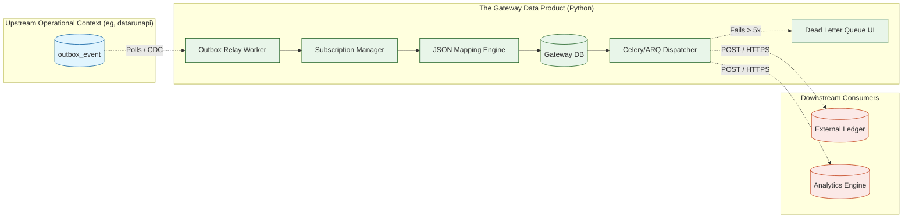

# Central Transformation & Delivery Engine (Gateway Product)

> **Status:** Draft / Conceptual Architecture  
> **Role:** Independent Data Product / Integration Bounded Context  
> **Proposed Stack:** Python (FastAPI, Celery/ARQ, SQLAlchemy)

## 1. Product Vision & Identity

The **Gateway** is a standalone, reusable Data Product. Its sole purpose is to act as the universal bridge between operational systems (like `datarunapi` data capture) and external consumers (like centralized ledgers, analytics engines, or third-party webhooks).

It is designed to be completely **agnostic of business logic**. It does not know what a "Malaria Form" or a "Stock Take" is. It only understands:
1.  **Ingesting** untyped, immutable JSON events from upstream sources (via Outboxes or queues).
2.  **Mapping** that JSON into specific shapes required by downstream consumers using config-driven scripts.
3.  **Delivering** the mapped JSON reliably over the network with guaranteed exactly-once or at-least-once semantics.

By extracting this into its own Python-based product, we achieve total decoupling: when a downstream Ledger changes its API contract, the `data-capture` developers do not write a single line of code. The mapping configuration in the Gateway is simply updated.

---
title: Overview

## 2. Core Responsibilities

| Responsibility               | Description                                                                                                                             |
|:-----------------------------|:----------------------------------------------------------------------------------------------------------------------------------------|
| **Event Ingestion (Relay)**  | Continuously polling upstream Outbox tables (or listening to Kafka/RabbitMQ) for new "Fat Events" emitted by operational systems.       |
| **Dynamic Routing**          | Determining *where* a payload should go based on data-driven `Subscription` configurations (e.g., "Route Template 'A' to Webhook 'B'"). |
| **Payload Transformation**   | Evaluating dynamic scripts (e.g., JSONata, JQ, or Python AST) to reshape upstream JSON into strict downstream Data Contracts.           |
| **Configurable Idempotency** | Extracting specific values from the payload to act as deterministic `Idempotency-Key`s for downstream systems.                          |
| **Reliable Delivery**        | Dispatching HTTP requests with exponential backoff, managing timeouts, and routing permaline failures to a Dead Letter Queue (DLQ).     |
| **Complete Auditability**    | Maintaining a `delivery_audit_log` as the ultimate system-of-record proving exactly what was sent, when, and what the consumer replied. |

### What this Gateway is NOT:
*   **It is not the Ledger Adapter:** The Ledger might have its own internal adapter to ingest data. The Gateway just delivers JSON to a URL.
*   **It is not a Business Rule Engine:** It does not run form validations or check if a patient is eligible for a drug. It purely maps and routes data that is already valid and saved.

---
title: Overview

## 3. High-Level Architecture

Because its workload is intensely I/O bound (waiting on HTTP requests, polling databases) and heavily reliant on dynamic JSON manipulation, the ideal stack for this product is **Python**.

---
title: Overview

## 4. The Data Models (Config-Driven Engine)

The Gateway's internal database relies on the following core entities:

1.  **`Destination`:** Defines an external consumer. (URL, Auth Tokens, Rate Limits).
2.  **`Subscription`:** Links an upstream event type (e.g., `form_template_id: 'covid_19'`) to a `Destination`.
3.  **`PayloadMapper`:** Contains the mapping script (JSONata/Python) required to translate the upstream Fat Event into the Destination's schema.
4.  **`DeliveryTask`:** Represents a single scheduled delivery attempt. Tracks `status` (PENDING, IN_FLIGHT, FAILED_RETRY, DELIVERED, DEAD_LETTER) and `retries_count`.
5.  **`DeliveryAuditLog`:** Immutable record of every HTTP request made, storing the exact request body, headers, response status, and response body.

---
title: Overview

## 5. Integration Contracts (What the Gateway Expects)

For an upstream application (like `datarunapi`) to "plug in" to this Gateway, it must expose data in a highly specific way. 

The Gateway expects to consume a **Bi-Temporal Fat Event**.

### The Anatomy of the Expected Payload
The Gateway expects the upstream system to provide events containing these strict fields:

1.  **`aggregate_id`:** The primary identifier of the business object (e.g., `submission_uid`).
2.  **`correlation_id`:** A UUID generated at the very edge (the mobile client) that tracks this specific action across the entire enterprise. The Gateway will pass this downstream.
3.  **`occurred_at`:** The device timestamp when the action physically happened in the real world (crucial for Offline-First upstream systems).
4.  **`recorded_at`:** The server timestamp when the data was locked into the upstream database.
5.  **`payload`:** The complete, normalized JSON representation of the data. **The Gateway will not query the upstream API to get missing data.** The payload must be complete inside the event.

> *For specific details on how the `datarunapi` capture product fulfills this contract, see its internal integration documentation.*
